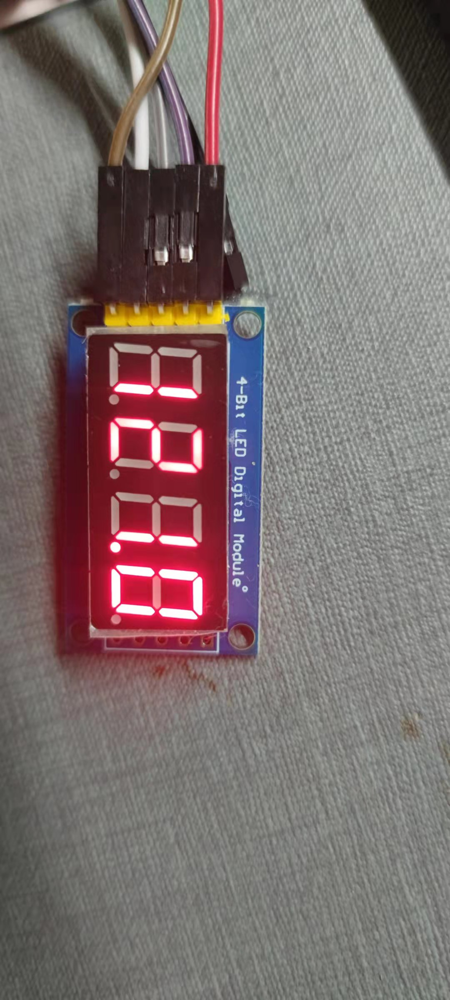
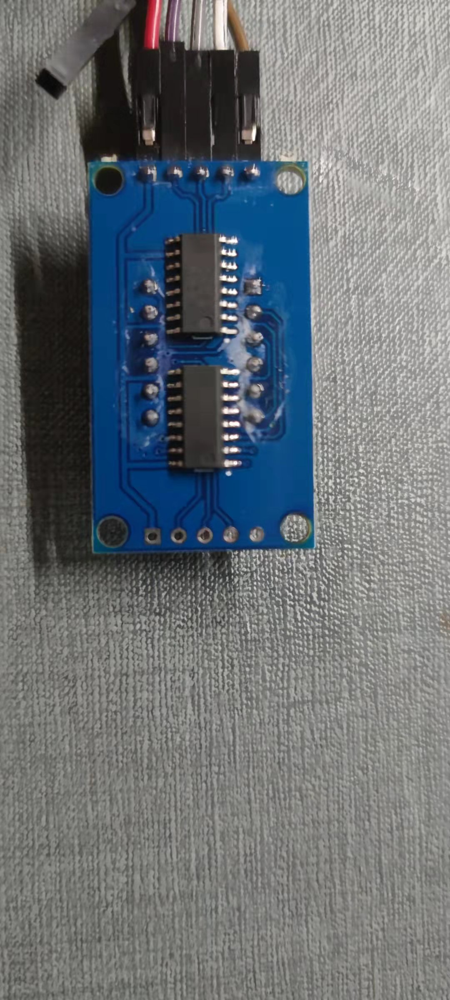

# Led4

Arduino library for 4-Bit LED Digital Tube Module with two 74HC595D-chip





## Usage

```
#include <Arduino.h>
#include <Ticker.h>
#include <Led4.h>
Led4 led4;

void flip()
{

  led4.display("-1000", 0);

  // led4.display(22, 1);

  // led4.display(-995, 2);

  // led4.display(99999, -1);
}

void setup()
{
  Serial.begin(115200);
  /// SCLK,  RCLK,  DIO
  led4.begin(2, 14, 13);
  ///
  flipper.attach_ms(1, flip);
}

void loop()
{
}
```
